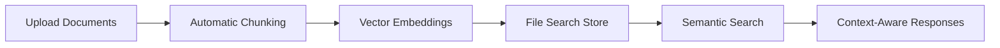

# Gemini RAG Multi-Store Chat Application

A powerful Retrieval-Augmented Generation (RAG) chat application demonstrating the capabilities of Google's Gemini File Search API with multiple specialized knowledge stores.

---

## 📖 Table of Contents

1. [Understanding Gemini File Search](#-understanding-gemini-file-search)
2. [About This Project](#-about-this-project)
3. [Getting Started](#-getting-started)
4. [Usage](#-usage)
5. [API Documentation](#-api-documentation)
6. [Project Structure](#-project-structure)
7. [Configuration](#-configuration)

---

## 🧠 Understanding Gemini File Search

### What is Gemini File Search?

**Gemini File Search** is a powerful feature of Google's Gemini AI that enables intelligent document search and retrieval. It allows you to upload documents (PDFs, text files, etc.) and then ask questions about their content using natural language.

### How Does It Work?



#### Key Concepts

1. **File Upload**: Documents are uploaded to Google's servers via the Gemini API
2. **Automatic Chunking**: Gemini automatically splits documents into optimal chunks
3. **Vector Embeddings**: Each chunk is converted into mathematical representations (vectors)
4. **File Search Stores**: Documents are organized into searchable "stores" (like vector databases)
5. **Semantic Search**: When you ask a question, Gemini finds the most relevant chunks
6. **Augmented Generation**: The AI generates responses grounded in your documents

### Why Use File Search?

| Traditional RAG | Gemini File Search |
|----------------|-------------------|
| Manual chunking strategy | ✅ Automatic optimal chunking |
| Choose embedding model | ✅ Built-in embeddings |
| Manage vector database | ✅ Managed storage |
| Implement retrieval logic | ✅ Integrated search |
| Complex infrastructure | ✅ Simple API calls |

### File Search Capabilities

- **Supported Formats**: PDF, TXT, HTML, Markdown, and more
- **Chunking**: Intelligent document segmentation with overlap
- **Multi-file Search**: Query across multiple documents simultaneously
- **Store Management**: Organize documents into logical groups
- **Real-time Updates**: Add or remove documents from stores dynamically

### Basic File Search Workflow

```python
from google import genai

# 1. Initialize client
client = genai.Client(api_key="YOUR_API_KEY")

# 2. Upload a document
file = client.files.upload(
    file='document.pdf',
    config={'name': 'my-document'}
)

# 3. Create a File Search store
store = client.file_search_stores.create(
    config={'display_name': 'My Knowledge Base'}
)

# 4. Import file into store
operation = client.file_search_stores.import_file(
    file_search_store_name=store.name,
    file_name=file.name
)

# 5. Query with File Search tool
response = client.models.generate_content(
    model="gemini-2.5-flash",
    contents="What does the document say about...?",
    config={
        'tools': [{
            'file_search': {
                'file_search_store_names': [store.name]
            }
        }]
    }
)
```

### File Search Use Cases

- 📚 **Document Q&A**: Answer questions about research papers, manuals, reports
- 🏢 **Enterprise Knowledge Bases**: Search company documentation and policies
- 📖 **Educational Tools**: Interactive learning from textbooks and materials
- 🔍 **Legal/Compliance**: Query contracts, regulations, and legal documents
- 📊 **Data Analysis**: Extract insights from reports and data documentation

---

## 🚀 About This Project

This project is a **practical demonstration** of Gemini File Search capabilities, implementing a multi-store RAG system with a modern web interface.

### 🌟 Features

- **Multi-Store Architecture**: Three specialized knowledge bases (Business, Science, Story)
- **Unified Search**: Query all stores simultaneously or search individual domains
- **Real-time Chat**: Interactive chat interface with markdown-formatted responses
- **Pre-indexed Knowledge**: Uses pre-configured Gemini File Search stores for instant queries
- **Modern UI**: Beautiful, responsive React frontend with glassmorphism design
- **RESTful API**: Clean FastAPI backend with CORS support

### 🏗️ System Architecture

```
┌─────────────┐      ┌──────────────┐      ┌─────────────────────┐
│   React     │─────▶│   FastAPI    │─────▶│   Gemini File       │
│   Frontend  │      │   Backend    │      │   Search Stores     │
│             │◀─────│              │◀─────│                     │
│  (Vite)     │      │  (Python)    │      │  - Business Store   │
│             │      │              │      │  - Science Store    │
│             │      │              │      │  - Story Store      │
└─────────────┘      └──────────────┘      └─────────────────────┘
```

### 📚 Tech Stack

**Backend**
- FastAPI - Modern Python web framework
- Google Generative AI - Gemini 2.5 Flash model
- Python-dotenv - Environment variable management
- Uvicorn - ASGI server

**Frontend**
- React 19 - UI library
- Vite - Build tool and dev server
- Axios - HTTP client
- React Markdown - Markdown rendering

---

## 🚀 Getting Started

### Prerequisites

- **Python 3.8+**
- **Node.js 18+** and npm
- **Google AI API Key** ([Get it here](https://makersuite.google.com/app/apikey))
- **Pre-created Gemini File Search Stores** with indexed documents

### Installation

1. **Clone the repository**
   ```bash
   git clone https://github.com/yourusername/Freecodecamp-Gemini-Rag.git
   cd Freecodecamp-Gemini-Rag
   ```

2. **Set up environment variables**
   
   Create a `.env` file in the root directory:
   ```env
   GOOGLE_API_KEY="your-google-api-key-here"
   businessstore="fileSearchStores/business-XXXXXXXXXX"
   sciencestore="fileSearchStores/science-XXXXXXXXXX"
   storystore="fileSearchStores/story-XXXXXXXXXX"
   ```

3. **Install backend dependencies**
   ```bash
   cd backend
   pip install fastapi google-generativeai python-dotenv uvicorn
   ```

4. **Install frontend dependencies**
   ```bash
   cd ../frontend
   npm install
   ```

### Setting Up Your File Search Stores

If you need to create your own stores (instead of using pre-created ones):

```python
from google import genai
import os

client = genai.Client(api_key=os.getenv("GOOGLE_API_KEY"))

# Upload documents
business_file = client.files.upload(file='businesszerotoone.pdf')
science_file = client.files.upload(file='sciencebook.pdf')
story_file = client.files.upload(file='storyharry.pdf')

# Create stores
business_store = client.file_search_stores.create(
    config={'display_name': 'Business Store'}
)
science_store = client.file_search_stores.create(
    config={'display_name': 'Science Store'}
)
story_store = client.file_search_stores.create(
    config={'display_name': 'Story Store'}
)

# Import files into stores
client.file_search_stores.import_file(
    file_search_store_name=business_store.name,
    file_name=business_file.name
)
# ... repeat for other stores

# Copy the store IDs to your .env file
print(f"businessstore=\"{business_store.name}\"")
print(f"sciencestore=\"{science_store.name}\"")
print(f"storystore=\"{story_store.name}\"")
```

---

## 🎯 Usage

### Starting the Backend

```bash
cd backend
python main.py
```

The API server will start on `http://localhost:8000`

### Starting the Frontend

```bash
cd frontend
npm run dev
```

The frontend will start on `http://localhost:5173`

### Using the Application

1. Open your browser and navigate to `http://localhost:5173`
2. Select a knowledge store tab:
   - **Business** - Ask about business strategies, entrepreneurship
   - **Science** - Query scientific concepts and facts
   - **Story** - Questions about story plots and characters
   - **All Stores** - Search across all domains simultaneously
3. Type your question in the chat input
4. Receive AI-generated responses grounded in the indexed documents

---

## 📡 API Documentation

### Endpoints

| Endpoint | Method | Description |
|----------|--------|-------------|
| `/chat/business` | POST | Chat with Business knowledge store |
| `/chat/science` | POST | Chat with Science knowledge store |
| `/chat/story` | POST | Chat with Story knowledge store |
| `/chat/all` | POST | Chat with all stores simultaneously |

### Request Format

```json
{
  "message": "What is the key idea in Zero to One?"
}
```

### Response Format

```json
{
  "response": "According to the document, the key idea is..."
}
```

### Example cURL Request

```bash
curl -X POST http://localhost:8000/chat/business \
  -H "Content-Type: application/json" \
  -d '{"message": "What is a monopoly business?"}'
```

---

## 📂 Project Structure

```
Freecodecamp-Gemini-Rag/
├── backend/
│   ├── main.py                 # FastAPI application
│   ├── notebook.ipynb          # Gemini File Search exploration
│   ├── businesszerotoone.pdf   # Business knowledge document
│   ├── sciencebook.pdf         # Science knowledge document
│   └── storyharry.pdf          # Story knowledge document
├── frontend/
│   ├── src/
│   │   ├── components/
│   │   │   ├── ChatWindow.jsx  # Chat interface component
│   │   │   └── ChatWindow.css  # Chat styling
│   │   ├── App.jsx             # Main application
│   │   ├── App.css             # Main styling
│   │   ├── api.js              # API client
│   │   ├── index.css           # Global styles
│   │   └── main.jsx            # Entry point
│   ├── index.html
│   ├── vite.config.js
│   └── package.json
├── .env                        # Environment variables
└── README.md
```

---

## 🔧 Configuration

### Backend Configuration

The backend uses static store IDs from environment variables for instant startup.

**Key Points:**
- Model: `gemini-2.5-flash`
- System Instruction: Always use file_search tool for document-grounded answers
- CORS: Enabled for all origins (configure for production)
- Port: 8000

### Frontend Configuration

**Key Points:**
- API Base URL: `http://localhost:8000`
- Dev Server Port: 5173
- Build Output: `dist/`

---

## 🐛 Troubleshooting

### Frontend Build Errors

```bash
cd frontend
rm -rf node_modules package-lock.json
npm install
npm run build
```

### Backend Issues

- Verify `.env` file exists in root directory
- Ensure store IDs are valid and accessible
- Check Google API key permissions

### CORS Errors

Update API base URL in `frontend/src/api.js` if needed.

---

## 📝 License

MIT License - free to use for learning and development

## 🤝 Contributing

Contributions welcome! Please submit a Pull Request.

---

**Built with ❤️ using Google Gemini File Search API**
